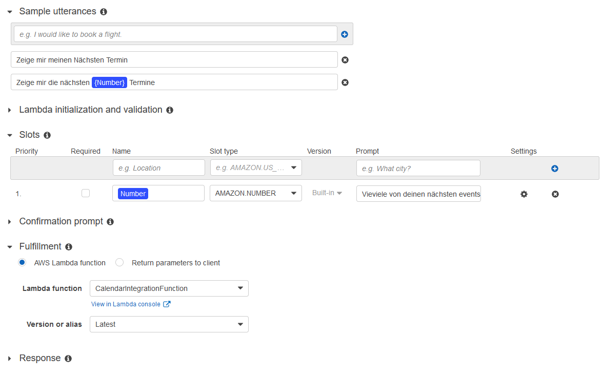
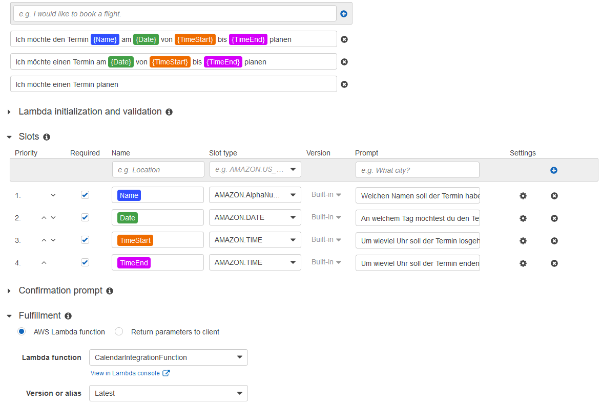

# GoogleCalendarIntegrationAWSsumerian  
##Goal
The goal of this project is to connect AWS Sumerian to the Google Calendar Api.
So that a person could request the creation of an event via voice Input that will then be created and inserted into the connected Goolge calendar  
##Working Principle
Connecting the Google Calendar Api to Sumerian is not possible directly but over a series of other AWS services.  
###AWS Sumerian
In Sumerian the host is responsible for managing the audio in and output as well as the communication to AWS Lex.  
When the host received a complete Audio Input from the User (Start the recording by holding down 'Space', stopping it by releasing 'Space')
It sends the data to the connected AWS Lex Bot. 

After the further processing, Sumerian will receive a Text as answer which the host will read out loud to the User.  
###AWS Lex
Lex receives the raw Audio input from AWS Sumerian. It is responsible for processing the audio and extracting information from it.  
Lex works with Intents. This Lex has two Intents working.
- CreateEvent  
- ListEvents


####CreateEvent
CreateEvent listens for the following sentence: "Ich möchte einen Termin planen" or slight variants of this sentence.  
It has the following parameters:
- Name *The name of the Event*
- Date *The date of the Event (Words like "Heute" or "Morgen" are also possible)*
- TimeStart *The time the event starts*
- TimeEnd *The time the event ends*  

Lex will ask the user about each one of the parameter using the Sumerian Host.

####ListEvents
ListEvents listens for the following sentences:
- Was sind meine nächsten *x* Termine?
- Was ist mein nächster Termin?

Or slight variants of them.  
It has the following parameter:
- Number *The number of next events that should be listed (default value = 1)*

Both Intents invoke a AWS Lambda function and give it a JSON file with all the information.

####An example JSON file for the Intent ListEvents:
```JSON
{
  "messageVersion": "1.0",
  "invocationSource": "FulfillmentCodeHook",
  "userId": "lzz3sdk56i48gg16768rwr0s2bc19sg4",
  "sessionAttributes": {},
  "requestAttributes": "null",
  "bot": {
    "name": "CalendarBot",
    "alias": "$LATEST",
    "version": "$LATEST"
  },
  "outputDialogMode": "Text",
  "currentIntent": {
    "name": "ListEvents",
    "slots": {
      "Number": "null"
    },
    "slotDetails": {
      "Number": "null"
    },
    "confirmationStatus": "None",
    "nluIntentConfidenceScore": "0.58"
  },
  "alternativeIntents": [
    {
      "name": "AMAZON.FallbackIntent",
      "slots": {},
      "slotDetails": {},
      "confirmationStatus": "None",
      "nluIntentConfidenceScore": "null"
    },
    {
      "name": "CreateEvent",
      "slots": {
        "TimeEnd": "null",
        "TimeStart": "null",
        "Date": "null",
        "Name": "null"
      },
      "slotDetails": {
        "TimeEnd": "null",
        "TimeStart": "null",
        "Date": "null",
        "Name": "null"
      },
      "confirmationStatus": "None",
      "nluIntentConfidenceScore": "0.15"
    }
  ],
  "inputTranscript": "Was ist mein nächster Termin?",
  "recentIntentSummaryView": "null",
  "sentimentResponse": "null",
  "kendraResponse": "null"
}
```

###AWS Lambda
The Lambda function contains a jar file which will be executed upon invocation of the function.  
The JSON file handed by AWS Lex will be passed to the function `handleRequest(Map<String, Object> inputMap, Context context)`in the Main Class as a Map Object.  
###The Java Code
The Java Function will first try to set up a connection to the Google Calendar using Google Calendar API.  
Since the Java Function is in the backend and cant reach to the frontend (Sumerian) without terminating and giving a valid response to Lex,  
it has no way to request Access to the users Google Calendar.
That's why the Credentials have to be baked into the uploaded jar File as described later in the **Setup** section.  
Once the Java function has access to the Google Calendar it processes the Map given by Lambda.  
The Java Function will first determine which one of the two Intents need to be executed by looking at the "name" value contained in the "currentIntent" Object.  
Based on the name, the function knows which slots to expect. They get extracted out of the Map and stored as variables in the code.  
####CreateEvent
If the current intent is to create and event, the function will do so by creating a new google.api event and specifying all the information necessary.  
It then inserts the event into the connected Google calendar, as well as creating a short response message that will be handed back to lex and sumerian.
####ListEvens
If the current intent is to list the upcoming events, the function requests the next *x* events from the Google calendar Api.  
It lists them and forms a response containing all the information. This response will be handed back to Lex and Sumerian.
---
The function now returns a class structure containing the response for Sumerian.  
This will be passed to Lex which hands it directly to Sumerian and its host which reads the response message out loud to the user.
##Setup
To set up the project, import the code into your IDE.  
Then create a Desktop OAUTH Client ID for the Google Project poc-virtual-assistant or request one if can't do that.   
As of now Josef Fuchshuber is the only active owner of this project.  
Download the Client ID in form of a JSON file. Rename the file to "credentials.json" and copy it into the resource folder of the java project.   
Comment out the Lines 130 to 141 in the Main class.
Now run the program via the main() function of the Main class. A browser window should open up requesting access to a google calendar.  
Select the google account with the calendar connected and grant access. The browser window can now be closed.  
In the Java project a new folder appeared called "credentials" and with it a file called "StoredCredential" inside.  
Copy the StoredCredential file into the resource Folder and uncomment the lines 130 to 141.  
Build the project using mvn and upload the jar larger jar file in the target folder to a lambda function that runs on Java 11 Corretto.  
In your lambda function, go to Config -> Environmental variables and create a new variable calle **"CREDENTIALS_PATH"** with the value **"/tmp/Credentials"**  
Now create a lex bot with the two intents as shown in the following pictures:  
*ListEvents: in the Lambda function slot select your function. Specify no responses*

*CreateEvent: in the Lambda function slot select your function. Specify no responses*

Now build and publish your bot.  
At this point you can test the bot by using the side panel build into Lex to chat with the bot.  
To set up sumerian follow this tutorial on [how to set up a chatbot using sumerian and lex](https://www.youtube.com/watch?v=OGmy3E2kMok&t=1548s)
and connect your bot as described in the video.  
Now you should be able to speak with you host and create/list events by voice control!